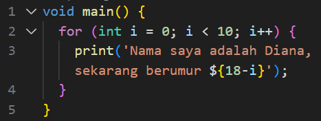
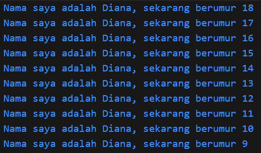

## Praktikum Pemrograman Mobile - Pertemuan 02

Nama: Diana Rahmawati 
Kelas: TI - 3G 
NIM: 2341720162 

#### Tugas Praktikum
##### Soal
1. Modifikasilah kode pada baris 3 di VS Code atau Editor Code favorit Anda berikut ini agar mendapatkan keluaran (output) sesuai yang diminta!

Output yang diminta (Gantilah Fulan dengan nama Anda):

2. Mengapa sangat penting untuk memahami bahasa pemrograman Dart sebelum kita menggunakan framework Flutter? Jelaskan!

3. Rangkumlah materi dari codelab ini menjadi poin-poin penting yang dapat Anda gunakan untuk membantu proses pengembangan aplikasi mobile menggunakan framework Flutter.

4. Buatlah penjelasan dan contoh eksekusi kode tentang perbedaan Null Safety dan Late variabel !

##### Jawab
1. Kode Program

Output


2. Karena Dart merupakan inti dari framework Flutter. Memahami bahasa dart adalah dasar untuk menggunakan Flutter, menjadikan kita lebih mudah dan lebih paham saat membuat aplikasi menggunakan Flutter

3. Rangkuman Codelab Pengantar Bahasa Pemrograman Dart
- Bahasa Dart merupakan inti dari framework Flutter, memahami Dart adalah dasar untuk bekerja dengan Flutter. 

- Dart bertujuan untuk mengabungkan kelebihan-kelebihan dan sebagian besar bahasa tingkat tinggi dengan fitur-fitur sebagai berikut
a. Productive tool: Tool untuk menganalisa kode, plugin IDE, dan ekosistem paket yang besar.
b. Garbage collection: mengelola atau menangani dealokasi memori
c. Type annotations (opsional): ntuk keamanan dan konsistensi dalam mengontrol semua data dalam aplikasi.
d. Statically typed: untuk menemukan bug selama kompilasi kode.
e. Portability: ahasa Dart tidak hanya untuk web tetapi juga dapat dikompilasi secara native ke kode Advanced RISC Machines (ARM) dan x86.

- Sejarah Dart
Dart diluncurkan pada tahun 2011, Dart merilis versi stabilnya pada tahun 2013, dengan perubahan besar termasuk dalam rilis Dart 2.0 menjelang akhir 2018, yang dapat diuraikan sebagai berikut:
a. Awalnya berfokus pada pengembangan web, dengan tujuan utama menggantikan JavaScript, sekarang telah fokus pada mobile development, termasuk framework Flutter.
b. Mencoba memecahkan masalah pada JavaScript
c. Menawarkan performa terbaik dan alat yang lebih baik untuk proyek berskala besar
d. Dibentuk agar kuat dan fleksibel

- Cara Kerja Dart
Cara mengeksekusi kode Dart dapat dilakukan dengan 2 cara yaitu:
1. Dart virtual machines (VMs)
2. JavaScript compilations
Kode Dart dapat dieksekusi pada lingkungan yang mendukung bahasa Dart dan memperhatikan fitur-fitur penting seperti:
a. Runtime systems
b. Dart core libraries
c. Garbage collectors
Ekseskusi kode Dart dapat beroperasi dalam 2 mode:
-  Just in Time (JIT): tempat kode sumber dikompilasi sesuai kebutuhan - Just in Time. Dart VM Dart VM memuat dan mengkompilasi kode sumber ke kode mesin asli (native). Pendekatan ini digunakan untuk menjalankan kode pada command line atau selama proses pengembangan aplikasi mobile yang dapat memanfaatkan fitur seperti debugging dan hot reload.
- Ahead of Time (AOT): dimana Dart VM dan kode dikompilasi sebelumnya, VM bekerja lebih seperti sistem runtime Dart, yang menyediakan garbage collector dan metode-metode native dari Dart software development kit (SDK) pada aplikasi. Pendekatan ini memiliki keuntungan performa yang sangat besar dibandingkan kompilasi JIT, tetapi fitur lain seperti debugging dan hot reload tidak tersedia.

- Pengenalan Stuktur Bahasa Dart
Sintaks Dart mirip dengan C atau JavaScript. Dart Menyediakan operator standar, built-in types, control flow, dan function mirip bahasa pemrograman lain.

- Object Orientation (OO)
Dart adalah object-oriented language. Objek terdiri dari fields (data) dan methods (kode). Objek dibuat dari class yang menerapkan prinsip OOP:
Encapsulation, Inheritance, Abstraction, Polymorphism. Desain OO Dart mirip dengan Java.

- Dart Operators
Operator di Dart adalah method dalam class dengan sintaks khusus. Contoh: x == y sama dengan memanggil x.==(y). Semua tipe data adalah objek, tidak ada tipe primitif seperti di Java. Operator bisa dioverride sesuai kebutuhan.

- Arithmetic Operators
1. + penjumlahan
2. - pengurangan
3. * perkalian
4. / pembagian → hasil double
5. ~/ pembagian bilangan bulat
6. % modulus (sisa bagi)
7. -expression negasi
8. Shortcut operators: +=, -=, *=, /=, ~/=
Operator + juga bisa dipakai untuk menggabungkan string.

- Increment & Decrement
1. ++var / var++ → tambah 1
2. --var / var-- → kurang 1
Umum digunakan dalam perulangan.

- Equality & Relational Operators
1. == sama
2. != berbeda
3. > lebih besar
4. < lebih kecil
5. >= lebih besar atau sama dengan
6. <= lebih kecil atau sama dengan
Dart: == membandingkan isi variabel, bukan alamat memori.
Tidak ada === seperti di JavaScript, karena Dart punya type safety.

- Logical Operators
!expression → negasi (true jadi false, sebaliknya)
|| → OR
&& → AND

-  Untuk belajar pemrograman Dart adalah dengan menggunakan DartPad karena mendukung core library Dart, kecuali library VM. 

4. Null safety adalah fitur di Dart yang digunakan untuk  mencegah variabel menyimpan nilai null secara tidak sengaja. Late Variable digunakan untuk memberi tahu Dart bahwa suatu variabel akan diinisialisasi nanti (bukan langsung saat deklarasi).
Contoh kode program:
```
void main() {
  late String? nama;        // Null boleh, tapi inisialisasi ditunda
  nama = null;
  print(nama);              // Output: null

  nama = "Diana Rahmawati";
  print(nama);              // Output: Diana Rahmawati
}
```
Jadi perbedaan dari Null Safety dan Late Variable adalah 
Null safety mengizinkan variabel bernilai null, sedangkan late variabel hanya menunda inisialisasi variabel. 

