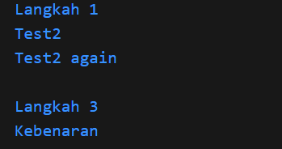
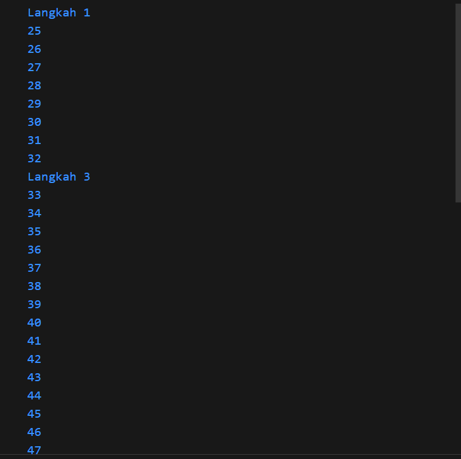
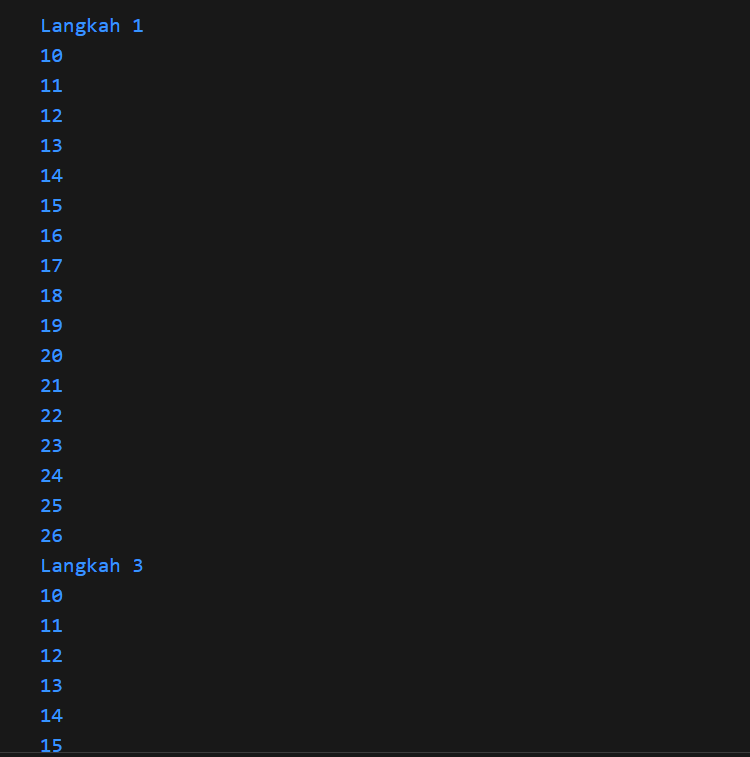
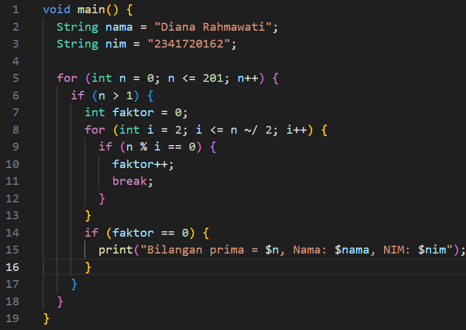
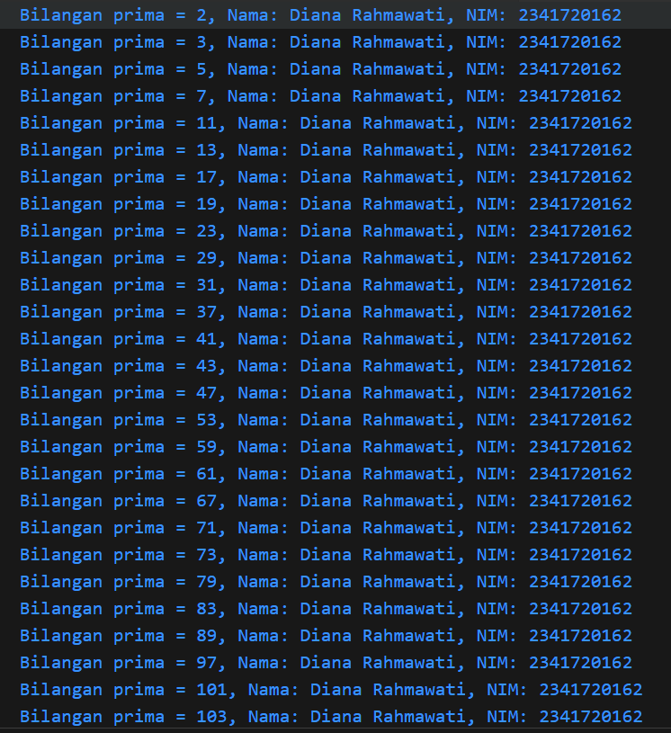

# Pertemuan 3 Mobile - Pengantar Bahasa Dart Bagian 2

Nama: Diana Rahmawati  
Kelas: TI -3G  
NIM: 2341720162

## Praktikum 1 - Menerapkan Control Flows ("if/else")
Pada langkah 1 terdapat error karena terdapat kesalahan penulisan pada kode if/else. Sedangkan pada langkah ke 3 terjadi error karena kondisi pemilihan belum didefinisikan.
Output praktikum 1:

## Praktikum 2 - Menerapkan Perulangan "while" dan "do-while"
Terdapat error pada langkah ke 1 dan 3 karena variabel counter belum dideklarasikan.

Output praktikum 2:

## Praktikum 3 - Menerapkan Perulangan "for" dan "break-continue"
Terdapat error pada langkah 1 karena variabel index belum dideklarasikan dan post increment pada variabel index belum ada. Pada langkah 3 tidak ada output karena menggunakan operator logika OR (||). 
Output praktikum 3:

## Tugas Praktikum 
Buatlah sebuah program yang dapat menampilkan bilangan prima dari angka 0 sampai 201 menggunakan Dart. Ketika bilangan prima ditemukan, maka tampilkan nama lengkap dan NIM Anda.

  
