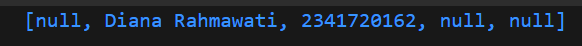
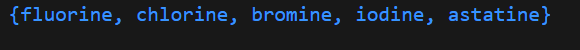
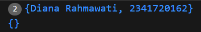
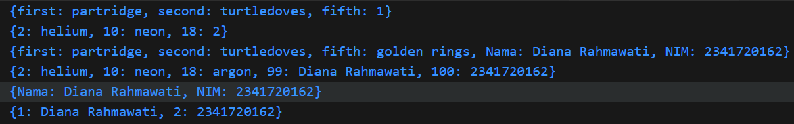
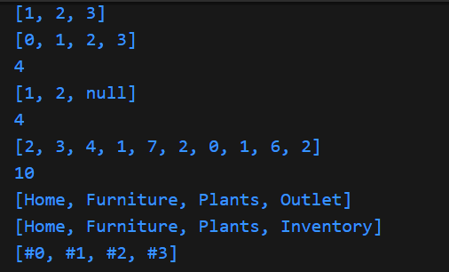
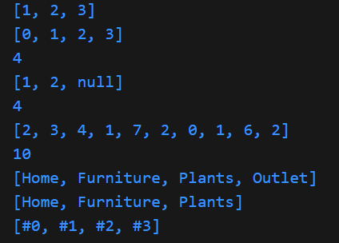
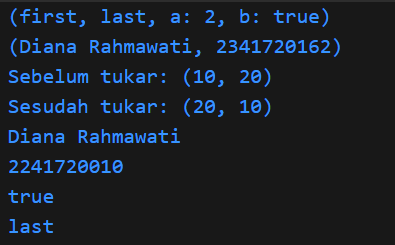

# Praktikum Mobile Pertemuan 4 - Pemrograman Bahasa Dart Bagian 3
Nama: Diana Rahmawati <br>
Kelas: TI - 3G <br>
NIM: 2341720162

## Praktikum
### Praktikum 1 - Eksperimen Tipe Data List
- Langkah 1 dan 2: Pada langkah 1 tidak terjadi error, output menampilkan angka 3 2 1
- Langkah 3: <br>


### Praktikum 2 - Eksperimen Tipe Data Set
- Langkah 1 <br>

- Langkah 3: output setlah diperbaiki <br>


### Praktikum 3 - Eksperimen Tipe Data Maps
Langkah 1 - 3 tidak ada error, Pada langkah ke 3 bagian awal, isi gifts dan nobleGases sudah dicetak (output pertama), kemudian terdapat assignment ulang: gifts['fifth'] yang awalnya 1 diganti jadi "golden rings" dan nobleGases[18] yang awalnya 2 diganti jadi "argon".
- Output Langkah 1 - 3 <br>


### Praktikum 4 - Eksperimen Tipe Data List: Spread dan Control-flow Operators
- Langkah 1 terdapat error karena variabel list1 tidak didefinisikan, dapat diperbaiki dengan mengganti variabel dengan yang sudah didefinisikan sebelumnya.
- Langkah 4, terdapat error karena variabel promoActive belum diinisialisasi, sehingga perlu diinisialisasi terlebih dahulu. Output jika kondisi true adalah [Home, Furniture, Plants, Outlet] sedangkan jika kondisi false adalah [Home, Furniture, Plants]. Penggunaan if di dalam list berfungsi untuk menambahkan elemen ke list hanya jika kondisi bernilai true.
- Langkah 5, terdapat error karena variabel login belum diinisialisasikan, sehingga perlu diinisialisasi terlebih dahulu. Outputnya ketika menggunakan login = 'Manager' akan muncul [Home, Furniture, Plants, Inventory] sedangkan jika login selain dengan status 'Manager' adalah [Home, Furniture, Plants]. Jadi elemen 'Inventory' hanya akan muncul kalau login cocok dengan 'Manager'.
- Langkah 6, kode ini menggunakan Collection For, yaitu cara menambahkan elemen ke list baru dengan melakukan iterasi pada list lain. Manfaatnya adalah kode menjadi lebih ringkas daripada membuat list kosong lalu melakukan for loop untuk menambahkan elemen, Membuat kode lebih bersih, mudah dibaca, dan deklaratif, dan Bisa dikombinasikan dengan collection if untuk menambahkan kondisi.
- Output langkah 1 - 6




### Praktikum 5 - Eksperimen Tipe Data Records
- Langkah ke 1, merupakan kode yang menggunakan Records yaitu tipe data mirip tuple yang bisa menyimpan beberapa nilai dengan nama (named fields) maupun tanpa nama (positional fields). pada langkah ini tidak terjadi error, karena dart sudah versi terbaru
- Langkah 3, pada langkah ini, kode ini terdapat Fungsi tukar yang menerima record (int, int). Kode var (a, b) = record; melakukan destructuring sehingga a = 10, b = 20. Return (b, a) dan nilai dibalik jadi (20, 10) pada fungsi main().
- Langkah 4, pada langkah 4 kode akan error karena variabel mahasiswa bertipe record tapi belum diinisialisasi. Untuk menyelesaikannya langsung inisialisasi record mahasiswa dengan field nama (String) dan NIM (int). 
- Langkah 5, Kode berhasil dijalankan karena di Dart bisa membuat record dengan kombinasi positional field ($1, $2, …) dan named field (a, b).
- Output langkah 1 - 5


## Tugas Praktikum
### Soal
1. Silakan selesaikan Praktikum 1 sampai 5, lalu dokumentasikan berupa screenshot hasil pekerjaan Anda beserta penjelasannya!
2. Jelaskan yang dimaksud Functions dalam bahasa Dart!
3. Jelaskan jenis-jenis parameter di Functions beserta contoh sintaksnya!
4. Jelaskan maksud Functions sebagai first-class objects beserta contoh sintaknya!
5. Apa itu Anonymous Functions? Jelaskan dan berikan contohnya!
6. Jelaskan perbedaan Lexical scope dan Lexical closures! Berikan contohnya!
7. Jelaskan dengan contoh cara membuat return multiple value di Functions!

### Jawab 
2. Function adalah blok kode yang bisa dipanggil untuk menjalankan suatu tugas tertentu dan berfungsi untuk modularisasi kode agar lebih rapi dan mudah digunakan.
3. 
- Positional Parameters: merupakan parameter standar yang harus disediakan saat memanggil fungsi sesuai dengan urutannya
- Optional Parameters: merupakan parameter yang bisa dihilangkan saat memanggil fungsi dan memiliki nilai default. Terdapat 2 jenis Optional parameter yaitu Parameter posisi opsional dan parameter bernama(opsional).
- Named Parameters: parameter ini sama seperti parameter bernama opsional, namun bisa juga dideklarasikan sebagai parameter wajib menggunakan required. Tanda kurung kurawal {} digunakan untuk menandai parameter bernama. 
```
// positional parameter
void tambah(int a, int b) {
  print(a + b);
}
void main() {
  tambah(2, 3); 
}

// optional parameter
void info(String nama, [int? umur]) {
  print("Nama: $nama, Umur: ${umur ?? 'tidak diketahui'}");
}
void main() {
  info("Diana");
  info("Diana", 21);
}

// named parameter
void sapa({String nama = "Anonim", int umur = 0}) {
  print("Halo $nama, umur $umur tahun");
}
void main() {
  sapa(nama: "Diana", umur: 21);
  sapa(); // Default
}
```
4. Function sebagai first class artinya function dapat disimpan dalam variabel, dikirim sebagai argumen, atau dikembalikan dari function lain.
```
void halo(String nama) {
  print("Halo $nama");
}
void eksekusi(void Function(String) f, String arg) {
  f(arg);
}
void main() {
  var sapa = halo; 
  sapa("Diana");

  eksekusi(halo, "Rahmawati"); 
}
```

5. Anonymous Functions merupakan function tanpa nama yang biasanya dipakai langsung pada kode baris (inline), sering dipakai untuk callback. 
```
void main() {
  var list = ['apel', 'pisang', 'jeruk'];

  list.forEach((item) {
    print("Buah: $item");
  });
}
```
6. Pada Lexical Scope, variabel hanya bisa diakses di dalam scope (cakupan) tempat fungsi tersebut dideklarasikan. Sedangkan pada Lexical Closure function yang menyimpan akses ke variabel di luar scope-nya, meskipun scope asal sudah selesai dieksekusi.
```
// lexical scope
void main() {
  var nama = "Diana";
  void sapa() {
    print("Halo $nama"); // bisa akses karena masih dalam scope
  }
  sapa();
}

// lexical closure
Function hitungKelipatan(int faktor) {
  return (int angka) => angka * faktor;
}

void main() {
  var kali2 = hitungKelipatan(2);
  var kali3 = hitungKelipatan(3);
  print(kali2(5)); 
  print(kali3(5)); 
}

```
7. Dart tidak bisa langsung return lebih dari 1 value dengan return biasa, tapi bisa dengan List, Map, dan Record
```
// list
List<int> hitung(int a, int b) {
  return [a + b, a - b];
}

// map
Map<String, int> hitung(int a, int b) {
  return {"tambah": a + b, "kurang": a - b};
}

// record
(int, int) hitung(int a, int b) {
  return (a + b, a - b);
}
```