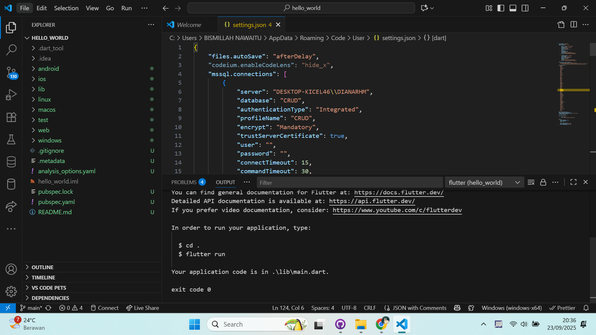
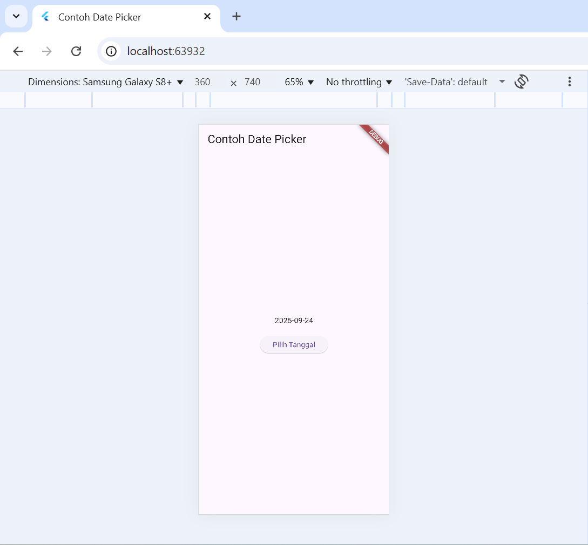
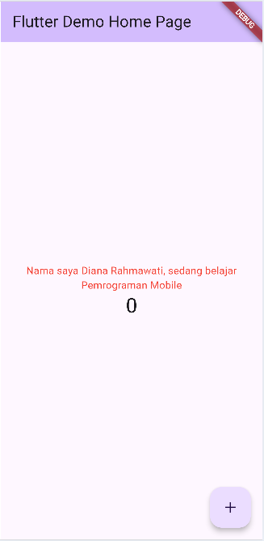
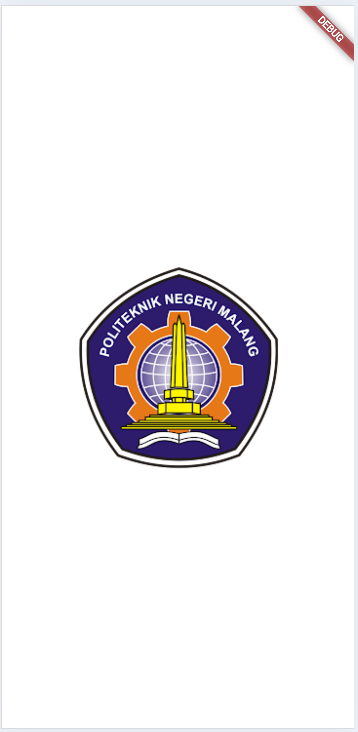
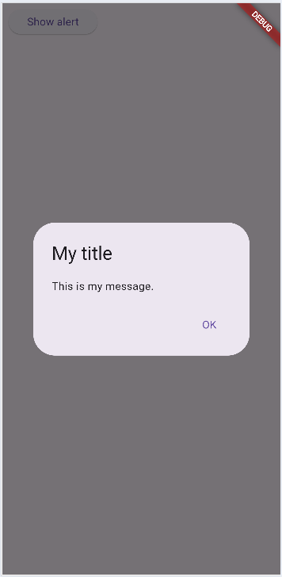
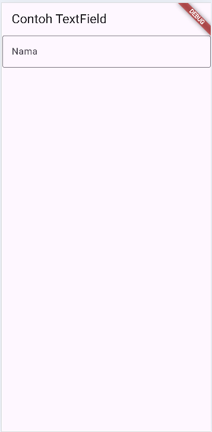
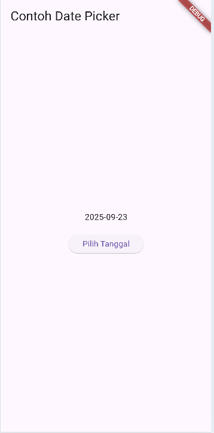
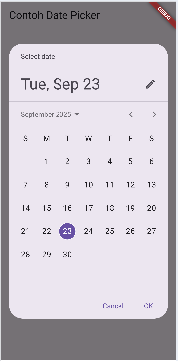

# Codelab 5 - Aplikasi Pertama dan Widget Dasar Flutter

Nama: Diana Rahmawati  
NIM: 2341720162  
Kelas: TI - 3G

## Praktikum 1
  

## Praktikum 2
Karena device tidak mendukung jadi pengujian dilakukan di chrome.  
  

## Praktikum 3
Sudah ada di github repositorinya.

## Praktikum 4
  
  

## Praktikum 5
- Langkah 4
  
- Langkah 5
  
  

- Langkah 6
  
  

