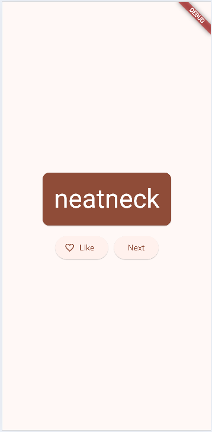

# Codelabs: Your first Flutter app

### Praktikum 4 - Menambahkan Tombol
  

### Praktikum 5 - Memperindah Tampilan Aplikasi
  
  
  
  
  
 

### Praktikum 6 - Menambahkan Fungsi
  
  

### Praktikum 7 - Menambahkan Kolom Samping Navigasi
  
  
  

### Praktikum 8 - Menambahkan Halaman Baru
  
  

