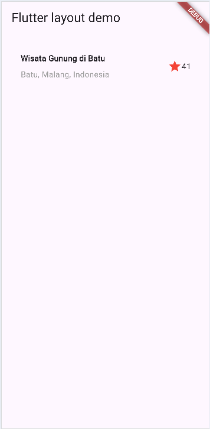
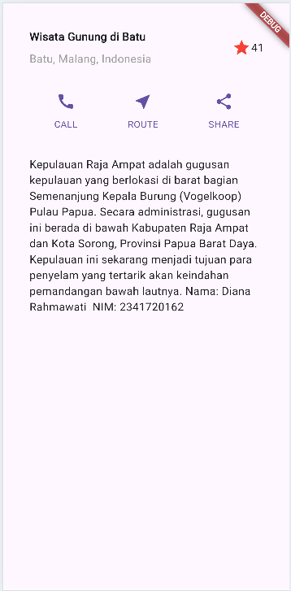
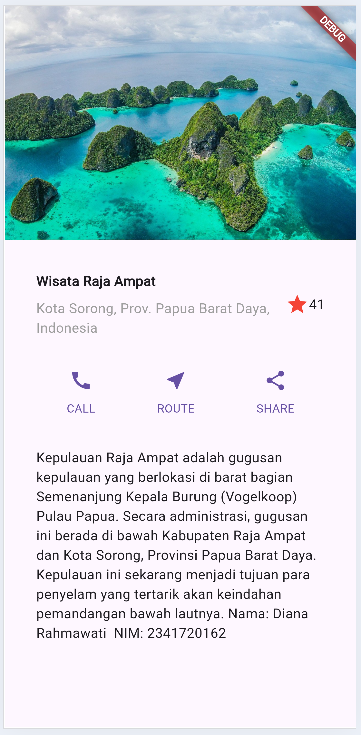
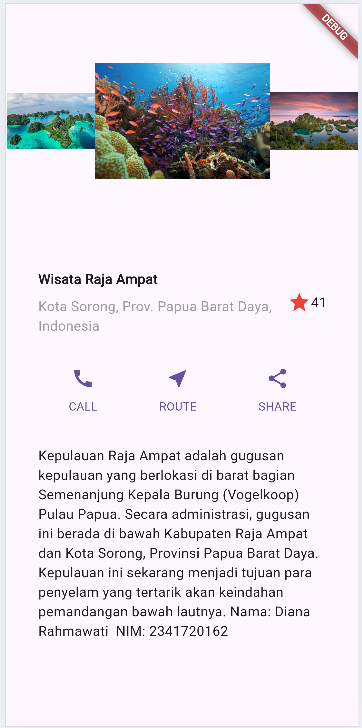
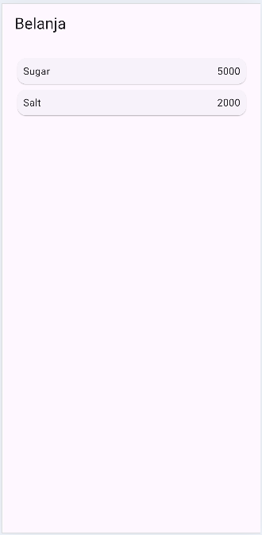
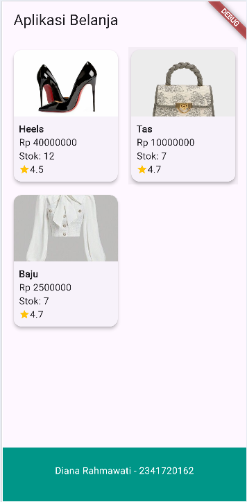

# CODELAB 06 - Layout dan Navigasi

Nama: Diana Rahmawati  
Kelas: TI - 3G  
NIM: 2341720162  

### Praktikum 1 - Membangun Layout di Flutter

### Praktikum 2 -Implementasi button row

### Praktikum 3 - Implementasi text section

### Praktikum 4 - Implementasi image section

### Tugas 1

### Praktikum 5 - Membangun Navigasi di Flutter
  

### Tugas 2
  

