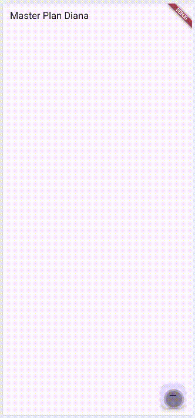
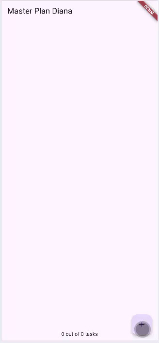
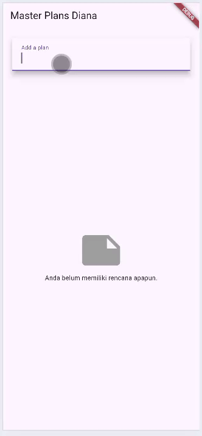

# PEMROGRAMAN MOBILE PERTEMUAN 10 - Dasar State Management

Nama: Diana Rahmawati
Kelas: TI - 3G
NIM: 23418720162

### PRAKTIKUM 1
  

#### Tugas Praktikum 1: Dasar State dengan Model-View
1. Selesaikan langkah-langkah praktikum tersebut, lalu dokumentasikan berupa GIF hasil akhir praktikum beserta penjelasannya di file README.md! Jika Anda menemukan ada yang error atau tidak berjalan dengan baik, silakan diperbaiki.
2. Jelaskan maksud dari langkah 4 pada praktikum tersebut! Mengapa dilakukan demikian?
3. Mengapa perlu variabel plan di langkah 6 pada praktikum tersebut? Mengapa dibuat konstanta ?
4. Lakukan capture hasil dari Langkah 9 berupa GIF, kemudian jelaskan apa yang telah Anda buat!
5. Apa kegunaan method pada Langkah 11 dan 13 dalam lifecyle state ?

#### Jawab
2. Langkah 4 bertujuan untuk menyederhanakan proses impor model di file lain. Tujuannya agar struktur kode lebih modular dan rapi dan memudahkan pengelolaan saat jumlah model bertambah.
3. Variabel plan digunakan untuk menyimpan data rencana (plan) yang sedang aktif ditampilkan pada layar. Di dalam Plan, ada properti tasks yang akan berubah setiap kali pengguna menambah, menghapus, atau memperbarui tugas di aplikasi. Variabel ini dibuat const karena  Plan dan Task adalah kelas yang immutable (tidak bisa diubah isinya langsung). Jadi, setiap kali ada perubahan, kita tidak mengubah objek lama, melainkan membuat objek Plan baru dengan data yang sudah diperbarui.
4. Hasil dari langkah 9 berupa tampilan daftar tugas (to-do list) dengan Checkbox untuk menandai apakah tugas sudah selesai atau belum dan TextFormField untuk menulis atau mengedit deskripsi tugas.
5. Langkah 11 digunakan untuk inisialisasi data awal atau controller sedangkan langkah 13 digunakan untuk membersihkan resource seperti controller, stream, atau listener agar tidak terjadi memory leak.

### PRAKTIKUM 2

####  Tugas Praktikum 2: InheritedWidget
1. Selesaikan langkah-langkah praktikum tersebut, lalu dokumentasikan berupa GIF hasil akhir praktikum beserta penjelasannya di file README.md! Jika Anda menemukan ada yang error atau tidak berjalan dengan baik, silakan diperbaiki sesuai dengan tujuan aplikasi tersebut dibuat.
2. Jelaskan mana yang dimaksud InheritedWidget pada langkah 1 tersebut! Mengapa yang digunakan InheritedNotifier?
3. Jelaskan maksud dari method di langkah 3 pada praktikum tersebut! Mengapa dilakukan demikian?
4. Lakukan capture hasil dari Langkah 9 berupa GIF, kemudian jelaskan apa yang telah Anda buat!

#### Jawab
2. Pada langkah 1, yang dimaksud dengan InheritedWidget merupakan kelas dasar Flutter yang memungkinkan suatu widget meneruskan data ke seluruh widget turunan (child widget) tanpa harus mengirim data secara manual lewat konstruktor setiap kali. InheritedNotifier digunakan karena bisa otomatis memberi tahu (notify) seluruh widget turunan ketika ada perubahan pada data yang diamati (ValueNotifier). Jadi setiap kali isi Plan berubah, semua widget yang bergantung padanya akan otomatis rebuild tanpa harus memanggil setState() lagi.
3. Karena langkah ini dapaet menyediakan informasi status progres pekerjaan tanpa harus menghitungnya manual di tampilan (UI), memisahkan logika dari tampilan, sehingga View (UI) cukup menampilkan plan.completenessMessage saja, dan mempermudah pembacaan dan pemeliharaan kode, karena fungsi perhitungan ditempatkan di dalam model (sesuai prinsip Model-View separation).
4. Hasil dari langkah 9 yaitu ketika pengguna menekan tombol +, daftar tugas bertambah secara otomatis, kemudian pengguna bisa mengetik deskripsi pada kolom teks dan saat checkbox dicentang, tugas dianggap selesa di bagian bawah layar (footer), muncul teks progres seperti 1 out of 3 tasks.

### PRAKTIKUM 3

#### Tugas Praktikum 3: State di Multiple Screens
1. Selesaikan langkah-langkah praktikum tersebut, lalu dokumentasikan berupa GIF hasil akhir praktikum beserta penjelasannya di file README.md! Jika Anda menemukan ada yang error atau tidak berjalan dengan baik, silakan diperbaiki sesuai dengan tujuan aplikasi tersebut dibuat.
2. Berdasarkan Praktikum 3 yang telah Anda lakukan, jelaskan maksud dari gambar diagram berikut ini!
3. Lakukan capture hasil dari Langkah 14 berupa GIF, kemudian jelaskan apa yang telah Anda buat!

#### Jawab
2. Dari diagaram tersebut dapat disimpulkan perbedaan widget tree antara layar utama dan layar detail, proses navigasi antar screen menggunakan Navigator.push(), dan bagaimana state tetap terjaga (shared) karena PlanProvider berada di level atas (MaterialApp), sehingga kedua screen berbagi data yang sama.
3. Hasil pada langkah 14 yaitu pada saat pertama kali, layar menampilkan pesan: “Anda belum memiliki rencana apapun.” Setelah pengguna mengetik nama plan baru di TextField dan menekan Enter, plan tersebut akan muncul di daftar. Setiap item plan menampilkan Judul plan dan Subjudul berupa teks progress, misalnya: “0 out of 3 tasks”
Jika pengguna menekan salah satu plan, aplikasi akan berpindah ke layar PlanScreen yang menampilkan daftar task dari plan tersebut. Di sana pengguna bisa menambah task dan menandai task sebagai selesai.