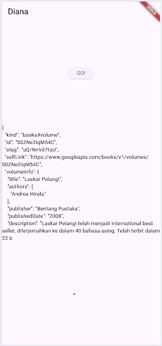
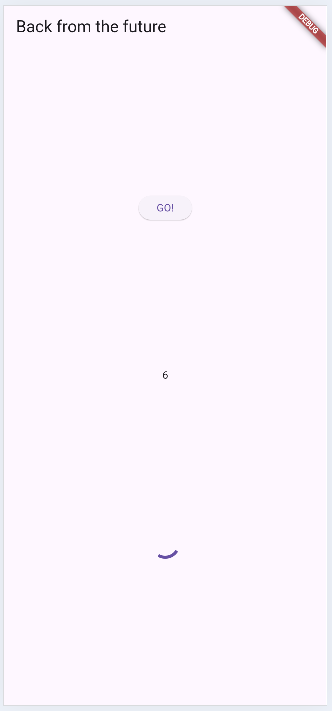
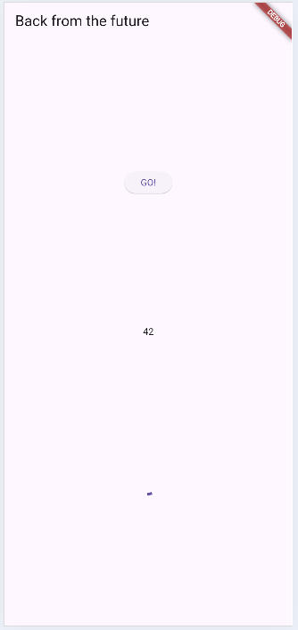
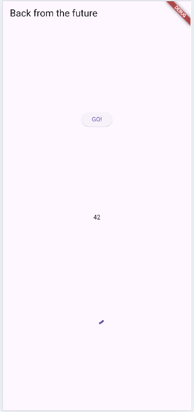
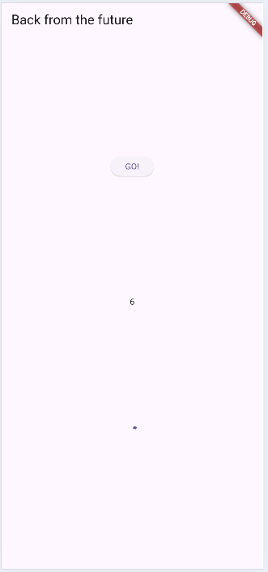
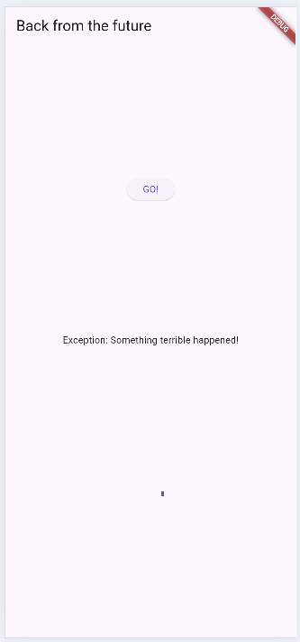
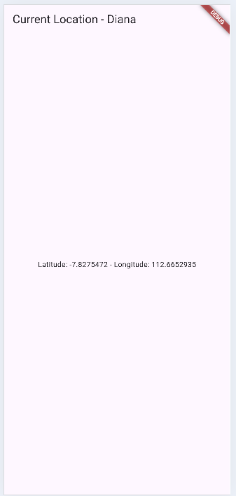
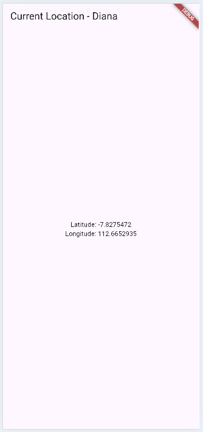
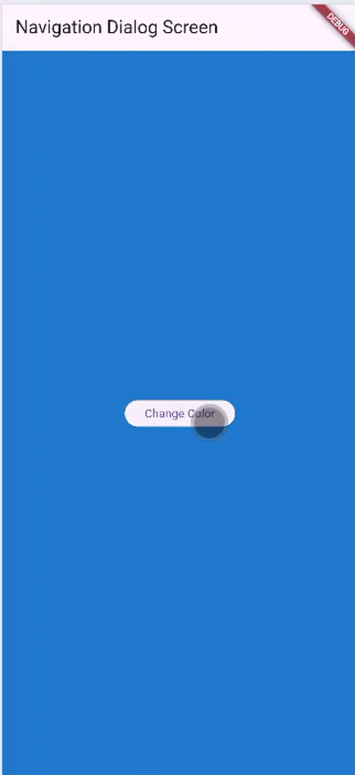

# PEMROGRAMAN MOBILE PERTEMUAN 11 - Pemrograman Asynchronous

Nama: Diana Rahmawati
Kelas: TI - 3G
NIM: 23418720162

##### Soal 3
1. Jelaskan maksud kode langkah 5 tersebut terkait substring dan catchError!
Jawab: substring digunakan untuk membatasi isi data jika berhasil dan catchError digunakan untuk menangani kondisi jika terjadi error agar app tidak crash dan bisa menampilkan pesan error.
2. Capture hasil praktikum Anda berupa GIF dan lampirkan di README. Lalu lakukan commit dengan pesan "W11: Soal 3".
  

##### Soal 4
1. Jelaskan maksud kode langkah 1 dan 2 tersebut!
Jawab: Langkah 1 digunakan untuk mensimulasikan tugas yang lambat (3 detik) lalu mengembalikan angka, langkah 2 digunakan untuk menunggu semua tugas selesai, menjumlahkan hasil, update UI
2. Capture hasil praktikum Anda berupa GIF dan lampirkan di README. Lalu lakukan commit dengan pesan "W11: Soal 4".
  

##### Soal 5
1. Jelaskan maksud kode langkah 2 tersebut!
Jawab: late Completer completer berfungsi untuk menyiapkan objek untuk mengontrol Future, getNumber() digunakan untuk membuat future yang pending dan memulai proses, dan calculate() menunggu 5 detik lalu menyelesaikan Future dengan nilai 42.
2. Capture hasil praktikum Anda berupa GIF dan lampirkan di README. Lalu lakukan commit dengan pesan "W11: Soal 5".
  

##### Soal 6
1. Jelaskan maksud perbedaan kode langkah 2 dengan langkah 5-6 tersebut!
Jawab: Pada langkah 2, Future hanya menyelesaikan proses dengan sukses dan selalu mengembalikan nilai 42 tanpa kemungkinan error. Sedangkan pada langkah 5–6 kode ditingkatkan agar memiliki mekanisme penanganan error menggunakan try–catch, di mana Future dapat diselesaikan dengan hasil sukses atau gagal melalui complete() dan completeError(). Perubahan ini memungkinkan pemanggil untuk menanggapi error menggunakan .catchError(), sehingga aplikasi menjadi lebih aman dan fleksibel dalam menangani kegagalan proses asynchronous.
2. Capture hasil praktikum Anda berupa GIF dan lampirkan di README. Lalu lakukan commit dengan pesan "W11: Soal 6".
  

##### Soal 7
1. Capture hasil praktikum Anda berupa GIF dan lampirkan di README. Lalu lakukan commit dengan pesan "W11: Soal 7".
  

##### Soal 8
1. Jelaskan maksud perbedaan kode langkah 1 dan 4!
Jawab: Perbedaan antara langkah 1 dan langkah 4 adalah fleksibilitas. Pada langkah 1, FutureGroup digunakan untuk menambahkan future secara bertahap sebelum akhirnya ditutup, sehingga cocok ketika jumlah future dinamis. Sedangkan pada langkah 4, Future.wait digunakan karena seluruh future sudah diketahui sejak awal dan dapat langsung dijalankan bersama dalam satu list. Future.wait lebih ringkas dan efisien untuk kasus daftar future statis, sementara FutureGroup lebih cocok untuk operasi asinkron yang jumlahnya berubah-ubah.

##### Soal 9
1. Capture hasil praktikum Anda berupa GIF dan lampirkan di README. Lalu lakukan commit dengan pesan "W11: Soal 9".
  

##### Soal 10
1. Panggil method handleError() tersebut di ElevatedButton, lalu run. Apa hasilnya? Jelaskan perbedaan kode langkah 1 dan 4!
Jawab: Pada langkah 1, kode hanya membuat method yang menghasilkan error secara sengaja tanpa penanganan apa pun, sehingga pemanggil bertanggung jawab untuk menangkap error tersebut. Pada langkah 4, method handleError() menambahkan mekanisme try–catch–finally untuk menangani error dari returnError(). Akibatnya, ketika error terjadi, UI tidak crash tetapi menampilkan pesan error, dan bagian finally selalu dijalankan sebagai pemberitahuan proses selesai. Dengan kata lain, langkah 1 hanya memproduksi error, sedangkan langkah 4 mengelola error dengan aman.

##### Soal 12
1. Jika Anda tidak melihat animasi loading tampil, kemungkinan itu berjalan sangat cepat. Tambahkan delay pada method getPosition() dengan kode await Future.delayed(const Duration(seconds: 3));
2. Apakah Anda mendapatkan koordinat GPS ketika run di browser? Mengapa demikian? 
Jawab: Karena Browser tidak mendukung requestPermission() plugin Geolocator dan isLocationServiceEnabled() tidak relevan di web. 
3. Capture hasil praktikum Anda berupa GIF dan lampirkan di README. Lalu lakukan commit dengan pesan "W11: Soal 12".
  

##### Soal 13
1. Apakah ada perbedaan UI dengan praktikum sebelumnya? Mengapa demikian?
2. Capture hasil praktikum Anda berupa GIF dan lampirkan di README. Lalu lakukan commit dengan pesan "W11: Soal 13".
  
3. Seperti yang Anda lihat, menggunakan FutureBuilder lebih efisien, clean, dan reactive dengan Future bersama UI.

##### Soal 14
1. Apakah ada perbedaan UI dengan langkah sebelumnya? Mengapa demikian?
2. Capture hasil praktikum Anda berupa GIF dan lampirkan di README. Lalu lakukan commit dengan pesan "W11: Soal 14".

##### Soal 16
1. Cobalah klik setiap button, apa yang terjadi ? Mengapa demikian ?
2. Gantilah 3 warna pada langkah 5 dengan warna favorit Anda!
3. Capture hasil praktikum Anda berupa GIF dan lampirkan di README. Lalu lakukan commit dengan pesan "W11: Soal 16".
  

##### Soal 17
1. Cobalah klik setiap button, apa yang terjadi ? Mengapa demikian ?
2. Gantilah 3 warna pada langkah 3 dengan warna favorit Anda!
3. Capture hasil praktikum Anda berupa GIF dan lampirkan di README. Lalu lakukan commit dengan pesan "W11: Soal 17".
  