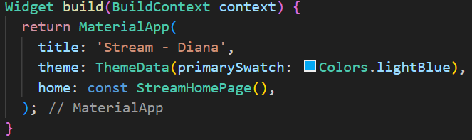
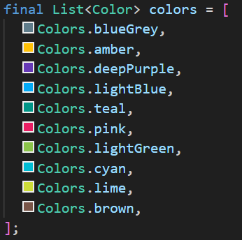
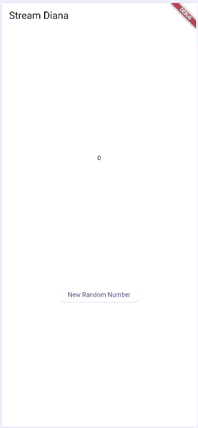
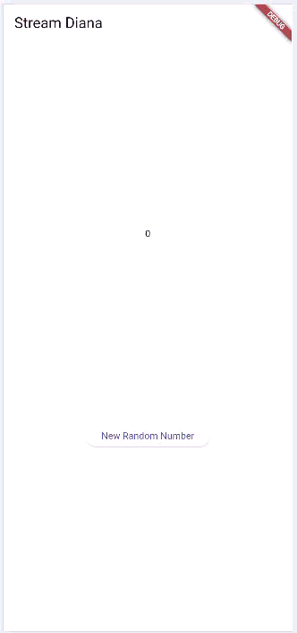
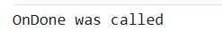
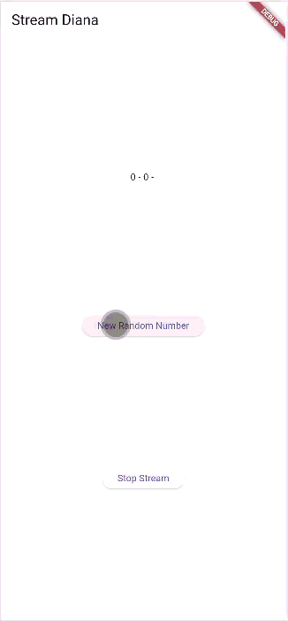

# PEMROGRAMAN MOBILE PERTEMUAN 12 - Lanjutan State Management dengan Streams

Nama: Diana Rahmawati
Kelas: TI - 3G
NIM: 23418720162

#### Soal 1
1. Tambahkan nama panggilan Anda pada title app sebagai identitas hasil pekerjaan Anda.
2. Gantilah warna tema aplikasi sesuai kesukaan Anda.
3. Lakukan commit hasil jawaban Soal 1 dengan pesan "W12: Jawaban Soal 1"  
  

#### Soal 2
1. Tambahkan 5 warna lainnya sesuai keinginan Anda pada variabel colors tersebut.
2. Lakukan commit hasil jawaban Soal 2 dengan pesan "W12: Jawaban Soal 2" 
  

#### Soal 3
1. Jelaskan fungsi keyword yield* pada kode tersebut! 
Jawab: fungsi keyword yield* yaitu digunakan untuk meneruskan seluruh event dari stream lain ke stream yang sebelumnya sudah dibuat, sehingga getColor() mengeluarkan event tanpa perlu memanggil yield satu per satu.
2. Apa maksud isi perintah kode tersebut? 
Jawab: Kode tersebut membuat aliran data (stream) yang setiap 1 detik mengirim warna baru, bergantian sesuai urutan daftar colors. Index warna selalu berputar dengan operasi modulo, sehingga background dapat berubah warna terus-menerus setiap detik.
3. Lakukan commit hasil jawaban Soal 3 dengan pesan "W12: Jawaban Soal 3"

#### Soal 4
1. Capture hasil praktikum Anda berupa GIF dan lampirkan di README. 
  
2. Lakukan commit hasil jawaban Soal 4 dengan pesan "W12: Jawaban Soal 4"

#### Soal 5
1. Jelaskan perbedaan menggunakan listen dan await for (langkah 9) ! 
Jawab: listen() membuat aplikasi tetap "bebas", function selesai langsung dan stream berjalan sendiri, sedangkan await for membuat method changeColor() menunggu sampai semua event selesai baru keluar.
2. Lakukan commit hasil jawaban Soal 5 dengan pesan "W12: Jawaban Soal 5"

#### Soal 6
1. Jelaskan maksud kode langkah 8 dan 10 tersebut! 
Jawab: Pada Langkah 8, kode di initState() digunakan untuk menyiapkan stream dan mendengarkannya. Setiap angka baru yang dikirim ke stream otomatis ditangkap oleh listen(), lalu disimpan ke variabel lastNumber menggunakan setState() agar UI langsung menampilkan angkanya. Sedangkan pada Langkah 10, method addRandomNumber() menghasilkan angka acak dan mengirimkannya ke stream melalui addNumberToSink(). Jadi, langkah 10 mengirim data ke stream, dan langkah 8 menampilkannya ke layar.
2. Capture hasil praktikum Anda berupa GIF dan lampirkan di README.
3. Lalu lakukan commit dengan pesan "W12: Jawaban Soal 6". 
  

#### Soal 7
1. Jelaskan maksud kode langkah 13 sampai 15 tersebut! 
Jawab: Langkah 13, Menambahkan method addError() agar StreamController dapat mengirimkan error. Ini memungkinkan untuk mensimulasikan kondisi gagal saat data dikirim ke Stream. 
Langkah 14, Memperbarui listener di initState() dengan menambahkan onError. Bagian ini berfungsi menangkap error yang dikirim oleh Stream dan menampilkan nilai -1 pada UI sebagai tanda adanya kesalahan. 
Langkah 15, Mengubah fungsi addRandomNumber() agar memanggil addError() alih-alih mengirim angka acak. Ini dilakukan untuk mengetes apakah mekanisme penanganan error pada Stream berjalan dengan benar. 
2. Kembalikan kode seperti semula pada Langkah 15, comment addError() agar Anda dapat melanjutkan ke praktikum 3 berikutnya.
3. Lalu lakukan commit dengan pesan "W12: Jawaban Soal 7".

#### Soal 8
1. Jelaskan maksud kode langkah 1-3 tersebut! 
Jawab: Langkah 1, Menambahkan variabel transformer untuk menyiapkan alat yang akan memproses atau memodifikasi data sebelum diterima listener. 
Langkah 2, Mengisi transformer dengan aturan pemrosesan: Data masuk akan dikalikan 10, Error diubah menjadi nilai -1, dan Sink ditutup saat stream selesai. 
Langkah 3, Menerapkan transformer pada stream. Data yang diterima listener sudah berupa hasil transformasi, dan jika terjadi error, UI otomatis menampilkan -1. 
2. Capture hasil praktikum Anda berupa GIF dan lampirkan di README.
3. Lalu lakukan commit dengan pesan "W12: Jawaban Soal 8". 
  

#### Soal 9
1. Jelaskan maksud kode langkah 2, 6 dan 8 tersebut! 
Jawab: Langkah 2, Menyiapkan stream untuk membuat controller, mengambil stream-nya, lalu melakukan listen. Setiap data baru dari stream otomatis diperbarui ke lastNumber.
Langkah 6, Menghentikan subscription saat widget dihapus supaya tidak terjadi kebocoran memori dan stream tidak terus berjalan.
Langkah 8, Mengirim angka acak ke stream jika controllernya masih terbuka. Jika controller sudah ditutup, tampilkan nilai -1 sebagai tanda error.
2. Capture hasil praktikum Anda berupa GIF dan lampirkan di README.
3. Lalu lakukan commit dengan pesan "W12: Jawaban Soal 9". 
  

#### Soal 10
1. Jelaskan mengapa error itu bisa terjadi ? 
Jawab: Karena pada kode terdapat dua kali listen() pada stream yang sama, sedangkan stream bawaan Flutter tidak mendukung banyak listener, sehingga memicu error “Stream has already been listened to”.

#### Soal 11
1. Jelaskan mengapa hal itu bisa terjadi ? 
Jawab: Karena stream memiliki dua listener aktif, yaitu subscription dan subscription2, dan keduanya menjalankan kode yang sama untuk menambahkan nilai ke variabel values. Jadi setiap kali stream menerima 1 angka baru, listener pertama menambahkan ke values, lalu listener kedua menambahkan lagi hasilnya dua kali.
2. Capture hasil praktikum Anda berupa GIF dan lampirkan di README.
3. Lalu lakukan commit dengan pesan "W12: Jawaban Soal 10,11". 
  

#### Soal 12
1. Jelaskan maksud kode pada langkah 3 dan 7 ! 
Jawab: Pada langkah 3, method getNumbers() dalam kelas NumberStream membuat sebuah stream yang menghasilkan angka acak setiap satu detik menggunakan Stream.periodic. Setiap pemanggilan periodik menghasilkan angka baru dari Random() sehingga stream terus mengirimkan data secara berurutan. Pada langkah 7, StreamBuilder digunakan untuk mendengarkan stream tersebut dan memperbarui tampilan setiap kali data baru diterima. initialData memberi nilai awal sebelum data pertama datang, sedangkan snapshot.data menampilkan angka terbaru di layar. Dengan demikian, angka pada UI terus berubah mengikuti data yang dikirimkan oleh stream.
2. Capture hasil praktikum Anda berupa GIF dan lampirkan di README.
3. Lalu lakukan commit dengan pesan "W12: Jawaban Soal 12". 
  

#### Soal 13
1. Jelaskan maksud praktikum ini ! Dimanakah letak konsep pola BLoC-nya ? 
Jawab: Praktikum ini bertujuan memperkenalkan pola BLoC (Business Logic Component), yaitu cara memisahkan logika aplikasi dari tampilan UI. Letak konsep pola BLoC ada pada pemisahan logika ke dalam kelas RandomNumberBloc, penggunaan Stream dan Sink untuk mengirim event dan state, serta mekanisme BLoC yang mengolah event dan memancarkan state baru ke UI.
2. Capture hasil praktikum Anda berupa GIF dan lampirkan di README.
3. Lalu lakukan commit dengan pesan "W12: Jawaban Soal 13". 
  