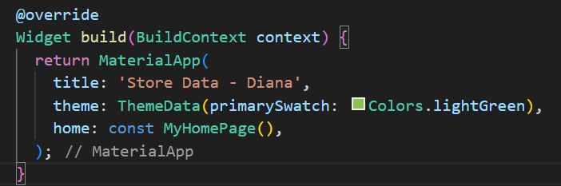
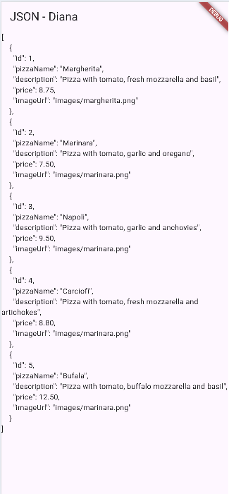
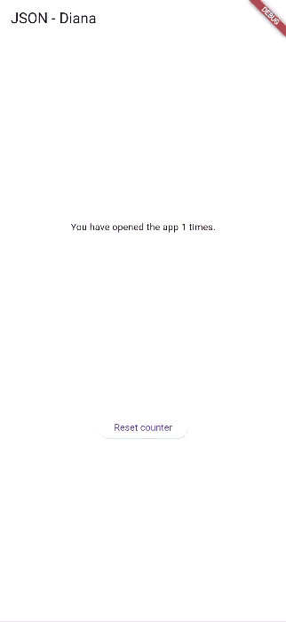
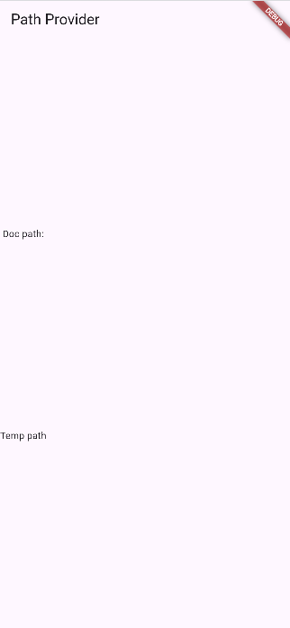
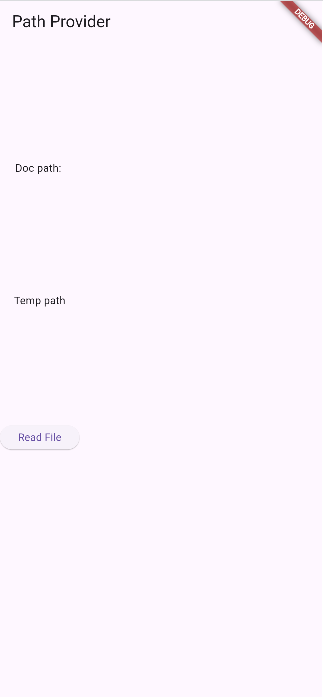
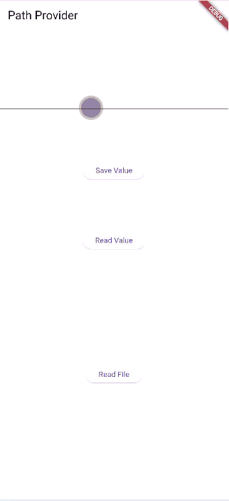

# PEMROGRAMAN MOBILE PERTEMUAN 13 - Persistensi Data

Nama: Diana Rahmawati  
Kelas: TI - 3G  
NIM: 2341720162

#### Soal 1
- Tambahkan nama panggilan Anda pada title app sebagai identitas hasil pekerjaan Anda.
- Gantilah warna tema aplikasi sesuai kesukaan Anda.
- Lakukan commit hasil jawaban Soal 1 dengan pesan "W13: Jawaban Soal 1"  
  

#### Soal 2
- Masukkan hasil capture layar ke laporan praktikum Anda.
- Lakukan commit hasil jawaban Soal 2 dengan pesan "W13: Jawaban Soal 2" 
  

#### Soal 3
- Masukkan hasil capture layar ke laporan praktikum Anda.
- Lakukan commit hasil jawaban Soal 2 dengan pesan "W13: Jawaban Soal 3" 
  

#### Soal 4
- Capture hasil running aplikasi Anda, kemudian impor ke laporan praktikum Anda!
- Lalu lakukan commit dengan pesan "W13: Jawaban Soal 4". 
  

#### Soal 5
- Jelaskan maksud kode lebih safe dan maintainable!  
Jawab: Aman bearti kode tidak rawan error, tidak menyebabkan crash, dan data tersimpan dengan benar. Maintainable berarti kode mudah dibaca, mudah diperbaiki, dan mudah dikembangkan.
- Capture hasil praktikum Anda dan lampirkan di README.
- Lalu lakukan commit dengan pesan "W13: Jawaban Soal 5". 
  

#### Soal 6
- Capture hasil praktikum Anda berupa GIF dan lampirkan di README.
- Lalu lakukan commit dengan pesan "W13: Jawaban Soal 6". 
  

#### Soal 7
- Capture hasil praktikum Anda dan lampirkan di README.
- Lalu lakukan commit dengan pesan "W13: Jawaban Soal 7". 
  

#### Soal 8
- Jelaskan maksud kode pada langkah 3 dan 7 !  
Jawab: Pada langkah 3, Method writeFile() adalah fungsi asinkron yang digunakan untuk menulis teks ke dalam sebuah file menggunakan perintah myFile.writeAsString(). Aplikasi mencoba menyimpan string ke file, dan jika penulisan berhasil, fungsi akan mengembalikan nilai true. Jika terjadi error—misalnya file tidak dapat diakses atau ada masalah I/O—kode di dalam blok catch akan menangkap error tersebut dan mengembalikan false sebagai tanda kegagalan.
- Capture hasil praktikum Anda berupa GIF dan lampirkan di README.
- Lalu lakukan commit dengan pesan "W13: Jawaban Soal 8". 
  

#### Soal 9
- Capture hasil praktikum Anda berupa GIF dan lampirkan di README.
- Lalu lakukan commit dengan pesan "W13: Jawaban Soal 9". 
  